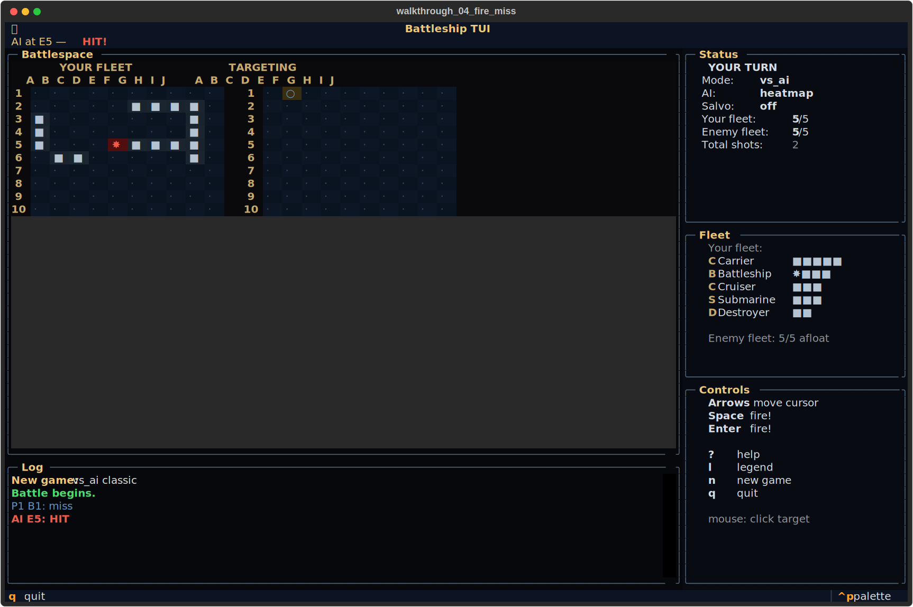
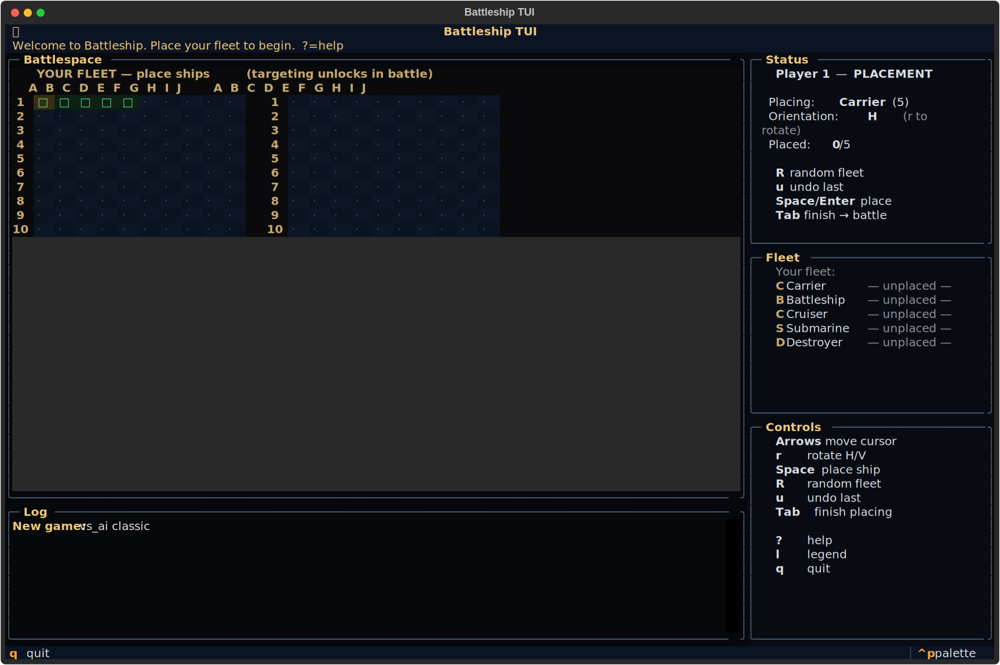

# battleship-tui
You sunk my battleship.





## About
Two 10×10 grids. Five ships. One patient opponent on the other side of the salvo. Place the fleet, call the shot, listen for the hit. Clean-room terminal Battleship — no plastic pegs, no brand-name ships, just the pure folk grid-shoot mechanic distilled to keyboard and hiss.

## Screenshots


## Install & Run
```bash
git clone https://github.com/akakabrian/battleship-tui
cd battleship-tui
make
make run
```

## Controls
### Placement phase

| Key             | Action                             |
|-----------------|------------------------------------|
| Arrow keys      | Move placement cursor              |
| `r`             | Rotate ship horizontal / vertical  |
| Space / Enter   | Place current ship                 |
| Shift+R         | Auto-place full random fleet       |
| `u`             | Undo last placement                |
| Tab or `b`      | Finish placement → battle          |

### Battle phase

| Key             | Action                             |
|-----------------|------------------------------------|
| Arrow keys      | Aim on targeting board             |
| Space / Enter   | Fire!                              |
| Mouse click     | Click to place / fire              |

### Anywhere

| Key        | Action                          |
|------------|---------------------------------|
| `?`        | Help                            |
| `l`        | Legend                          |
| `n`        | New game                        |
| `q`        | Quit                            |

## Testing
```bash
make test       # QA harness
make playtest   # scripted critical-path run
make perf       # performance baseline
```

## License
MIT

## Built with
- [Textual](https://textual.textualize.io/) — the TUI framework
- [tui-game-build](https://github.com/akakabrian/tui-foundry) — shared build process
